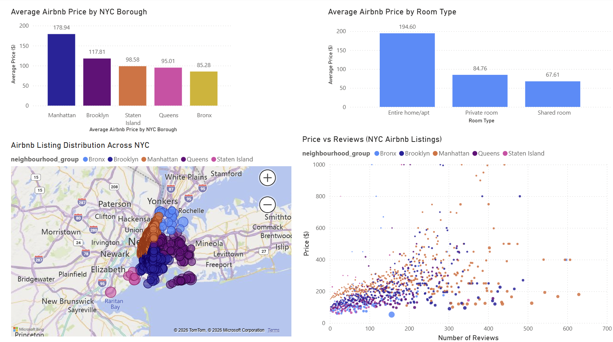
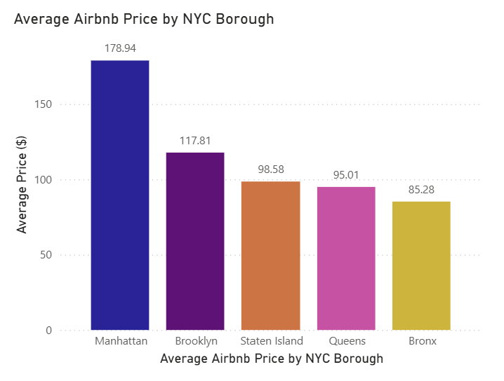
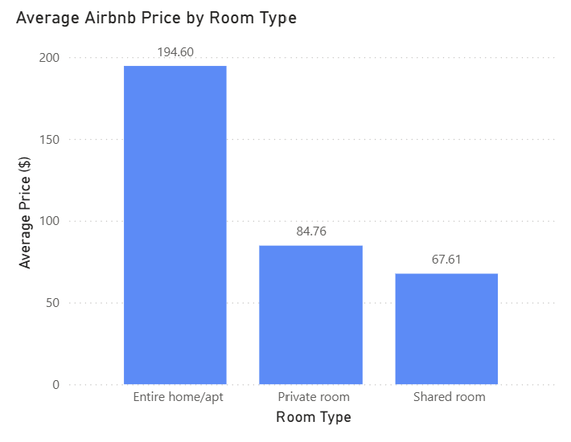
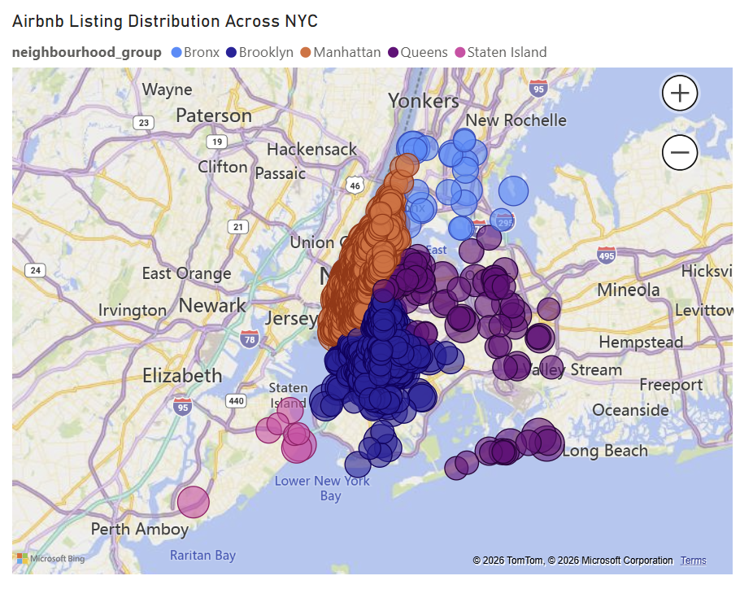
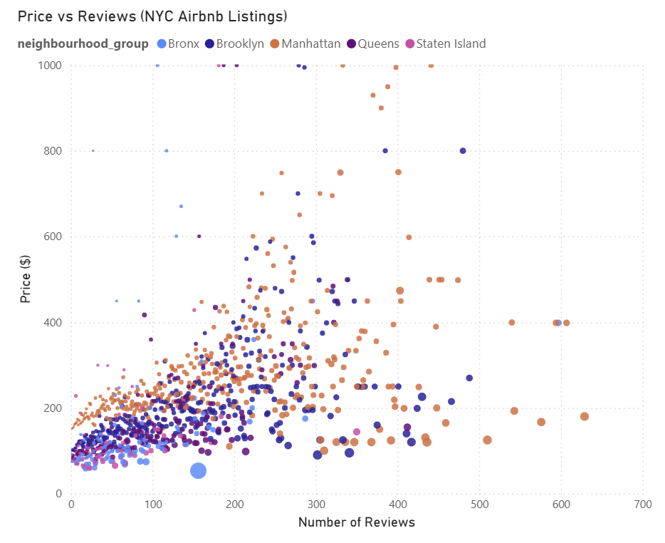

# NYC Airbnb Price Analysis Dashboard

## Overview

This project analyzes Airbnb listing data across New York City using Power BI to evaluate pricing behavior, room type differences, geographic distribution, and the relationship between listing price and review activity. The dashboard is designed to provide both a high-level summary of the NYC short-term rental market and deeper insight into the factors that influence listing performance.

The analysis focuses on understanding how location and listing characteristics affect pricing, identifying where Airbnb activity is most concentrated, and examining whether listing popularity, measured by review activity, is associated with pricing strategies.

## Analytical Approach

The dataset consists of individual Airbnb listings, where each record represents a unique property. Key attributes include borough, neighborhood, room type, price, number of reviews, reviews per month, availability, and geographic coordinates.

Data preparation was performed in Excel, where missing values were handled, duplicate records were removed, and data types were standardized to ensure accurate analysis. The cleaned dataset was then imported into Power BI for visualization.

The dashboard was structured around four core analytical dimensions:

- Geographic price variation across NYC boroughs  
- Price differences by room type  
- Spatial distribution of Airbnb listings  
- Relationship between price and review activity  

Each visual was intentionally designed to answer a specific analytical question and provide actionable insight into market behavior.

## Data Source

The dataset used in this project is a publicly available Airbnb dataset sourced from Kaggle. It contains listing-level data for New York City, including pricing, geographic coordinates, room type classifications, and review activity.

## Tools and Technologies

- Power BI for dashboard development and visualization  
- Excel for data cleaning and preprocessing  
- SQL for data exploration and validation  
- GitHub for version control and project presentation  

## Dashboard Overview



The dashboard provides a comprehensive overview of Airbnb pricing and listing patterns across New York City. It combines comparative, geographic, and relational visualizations to highlight how pricing varies by borough, room type, and demand indicators.

The layout is designed to guide the user from high-level comparisons to deeper analytical insights, enabling both quick interpretation and detailed exploration.

## Average Airbnb Price by NYC Borough



This visualization compares average Airbnb listing prices across NYC boroughs, revealing clear geographic pricing differences. Manhattan has the highest average listing price at approximately $179, followed by Brooklyn at approximately $118, while Queens, Staten Island, and the Bronx have significantly lower average prices.

This pattern highlights the strong influence of location on pricing. Manhattan’s premium pricing reflects its role as a central hub for tourism, business activity, and access to major attractions. Brooklyn’s relatively high pricing suggests strong secondary demand, likely driven by proximity to Manhattan and growing local appeal.

In contrast, the lower average prices in Queens, Staten Island, and the Bronx indicate more affordable markets, which may appeal to budget-conscious travelers.

From a business perspective, this suggests that hosts in high-demand areas have greater pricing power, while listings in outer boroughs may need to compete more aggressively on price to attract bookings.

## Average Airbnb Price by Room Type



This chart shows a clear pricing hierarchy across room types. Entire home or apartment listings have the highest average price at approximately $195, while private rooms average approximately $85 and shared rooms average approximately $68.

This demonstrates that room type is one of the most significant drivers of pricing. Entire home listings command a premium due to increased privacy, space, and convenience, making them more attractive to travelers seeking a full accommodation experience.

Private and shared rooms operate in a more price-sensitive segment of the market, targeting travelers who prioritize affordability over privacy.

From a strategic standpoint, this suggests that hosts offering entire properties have higher revenue potential per booking, while hosts offering private or shared spaces may rely more on volume and competitive pricing to maintain occupancy.

## Airbnb Listing Distribution Across NYC



The map visualizes the geographic distribution of Airbnb listings across NYC using latitude and longitude data. Listings are heavily concentrated in Manhattan and Brooklyn, with additional clusters in Queens and smaller distributions in the Bronx and Staten Island.

This concentration indicates that Airbnb activity is strongest in areas with high tourism demand, population density, and strong transportation access. Manhattan and Brooklyn appear to be the most competitive markets, where both supply and demand are high.

The lower density of listings in outer boroughs suggests less competition but also potentially lower demand.

From a market perspective, this highlights a trade-off between high-demand, high-competition areas and lower-demand, less saturated markets. Hosts entering the market must balance location advantages with competitive pressure.

## Price vs Number of Reviews



This scatter plot analyzes the relationship between listing price and review activity across NYC Airbnb listings. The majority of listings are concentrated within lower to mid-range price levels, while higher-priced listings appear less frequently and are more widely dispersed.

There is no strong linear relationship between price and number of reviews. Listings with high review counts are often found within moderate price ranges rather than among the most expensive listings. This suggests that highly reviewed listings are not necessarily premium-priced, but instead may be competitively priced and more frequently booked.

This pattern indicates that demand, as reflected by review activity, is influenced by factors such as affordability, location convenience, and listing visibility rather than price alone.

From a business perspective, this suggests that pricing strategies should balance revenue per booking with booking frequency. Listings priced competitively may generate higher engagement and more consistent demand over time compared to higher-priced listings with lower booking volume.

## Key Insights

- **Manhattan Dominates Pricing**  
  Manhattan consistently shows the highest average listing price, reflecting strong demand and premium market positioning.

- **Room Type Drives Pricing Structure**  
  Entire homes significantly outperform private and shared rooms in pricing, indicating a clear segmentation in the market.

- **Listings Are Highly Concentrated in Key Areas**  
  Manhattan and Brooklyn represent the most active and competitive Airbnb markets in NYC.

- **Review Activity Is Not Directly Linked to High Prices**  
  Listings with high review counts are often moderately priced, suggesting that demand is driven more by value and accessibility than premium pricing.

## Business Implications

- Hosts in Manhattan and Brooklyn can leverage strong demand but must differentiate in a highly competitive environment.  
- Entire home listings provide the highest revenue potential but may require greater investment and operational effort.  
- Competitive pricing strategies may increase booking frequency and long-term visibility.  
- Entering less saturated boroughs may reduce competition but requires careful positioning to attract demand.  
- Balancing price and occupancy is critical for maximizing overall revenue performance.

## Visualizations

- **Average Airbnb Price by NYC Borough**  
  Compares geographic pricing differences across boroughs.

- **Average Airbnb Price by Room Type**  
  Highlights how listing type influences pricing.

- **Airbnb Listing Distribution Across NYC**  
  Shows where listings are concentrated geographically.

- **Price vs Number of Reviews**  
  Examines the relationship between pricing and listing popularity.

## Project Structure

```plaintext
airbnb-analysis/
│
├── data/
│   ├── raw/
│   └── processed/
│       ├── cleaned_data.xlsx
│       └── cleaned_data.csv
│
├── sql/
│   └── airbnb_analysis.sql
│
├── dashboard/
│   └── nyc_airbnb_price_analysis_dashboard.pbix
│
├── images/
│   ├── dashboard_overview.png
│   ├── avg_price_by_borough.png
│   ├── avg_price_by_room_type.png
│   ├── nyc_listing_distribution_map.png
│   └── price_vs_reviews.png
│
├── docs/
│   └── project_summary.md
│
└── README.md
```

## How to View the Dashboard

1. Navigate to the `dashboard` folder in this repository  
2. Download the `.pbix` file  
3. Open it using Power BI Desktop  
4. Interact with the dashboard  

## Author

Daisy Sharma
